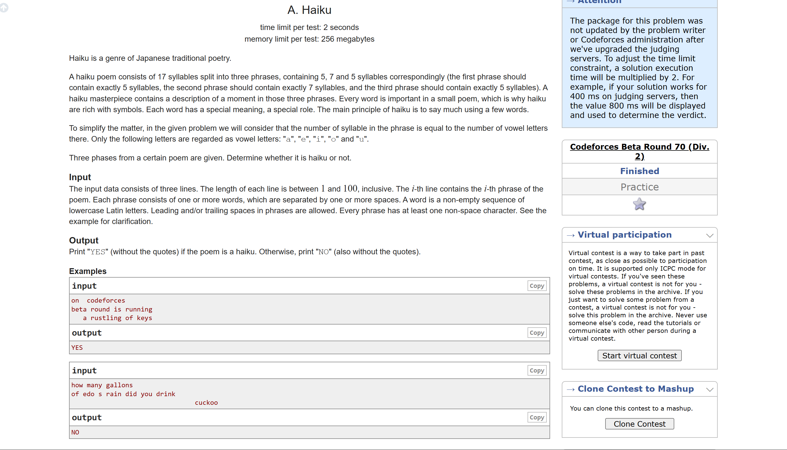

```
// import java.util.*;

// class codeforceQues {
//     public static void main(String args[]) {
//         Scanner sc = new Scanner(System.in);

//         String a = sc.nextLine();
//         String b = sc.nextLine();
//         String c = sc.nextLine();

//         int counta = 0, countb = 0, countc = 0;

//         for (char x : a.toLowerCase().toCharArray()) {
//             if (x == 'a' || x == 'e' || x == 'i' || x == 'o' || x == 'u') {
//                 counta += 1;
//             }
//         }
//         for (char x : b.toLowerCase().toCharArray()) {
//             if (x == 'a' || x == 'e' || x == 'i' || x == 'o' || x == 'u') {
//                 countb += 1;
//             }
//         }
//         for (char x : c.toLowerCase().toCharArray()) {
//             if (x == 'a' || x == 'e' || x == 'i' || x == 'o' || x == 'u') {
//                 countc += 1;
//             }
//         }

//         if (counta == 5 && countb == 7 && countc == 5) {
//             System.out.println("YES");
//         }
//         else {
//             System.out.println("NO");
//         }

//     }
// }

// Optimized code using one loop

import java.util.Scanner;

public class Main {
    public static void main(String[] args) {
        Scanner scanner = new Scanner(System.in);
        int count1 = 0, count2 = 0, count3 = 0;

        String line1 = scanner.nextLine();
        String line2 = scanner.nextLine();
        String line3 = scanner.nextLine();

        for (char c : (line1 + line2 + line3).toLowerCase().toCharArray()) {
            if (c == 'a' || c == 'e' || c == 'i' || c == 'o' || c == 'u') {
                if (count1 < 5) {
                    count1++;
                } else if (count2 < 7) {
                    count2++;
                } else {
                    count3++;
                }
            }
        }

        if (count1 == 5 && count2 == 7 && count3 == 5) {
            System.out.println("YES");
        } else {
            System.out.println("NO");
        }

        scanner.close();
    }
}
```